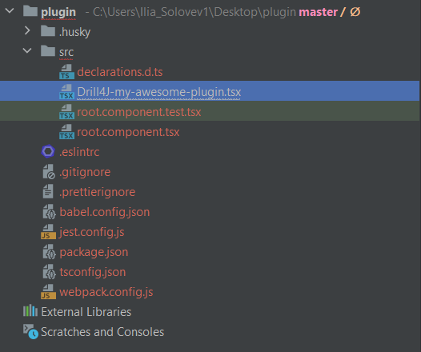

[Link to documentation](https://single-spa.js.org/docs/create-single-spa)

1. Run ```npx create-single-spa``` command
2. Choose parameters that you need
3. Select ```single-spa application / parcel``` in the third step
4. Type ```Drill4J``` on the fifth step
5. Continue ask to the questions

    After the successfully creating of the plugin you should see the same structure as 

6. Open ```Drill4J-my-awesome-plugin.tsx``` file
7. You will need to export 4 objects
    * AgentPlugin
    * AgentHUD
    * GroupPlugin
    * GroupHUD
## Example 
```
const AgentHUDLifecycle = singleSpaReact({
  React,
  ReactDOM,
  rootComponent: (props) => (
    <AgentHUDRootComponent {...props} />
  ),
  errorBoundary: ErrorBoundary,
});

export const AgentHUD = {
  mount: [
    AgentHUDLifecycle.mount,
  ],
  unmount: [
    AgentHUDLifecycle.unmount,
  ],
  update: AgentHUDLifecycle.update,
  bootstrap: AgentHUDLifecycle.bootstrap,
};
```
8. For development, you need to add property with name of plugin and path to sources in *use-plugin-urls.ts* file in *devModePaths* object with name of plugin. 
   Important that plugin should have name like on the backend. You cen check all plugin names in ````/agents/${agentId}/plugins```` topic.  

